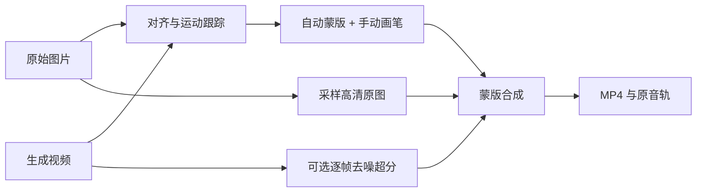

# Reference Restore Studio · 原图回贴

**把生成视频里变形、模糊或不一致的局部，擦回原始图片的内容。**

A local, browser-based reference-image restoration editor for generated videos. Align a reference image once or track it across frames, paint soft masks, and preview/export the composite with optional Real-ESRGAN upscaling and denoising.

本程序不生成视频，也不依赖 ComfyUI。它接收一张原图和一段生成视频，通过对齐与蒙版合成恢复原画细节，尽量保留视频的运动。适用于人物、插画、场景、产品等，不限定 Live2D。

> 实验性工具：自动对齐不是语义理解，大幅转头、遮挡或光照变化需要人工检查。可选超分是逐帧处理，**目前没有跨帧稳定功能，不保证消除闪烁**。

## 功能

- 原图与首帧特征匹配、逐帧双向光流、稳定区域初始蒙版。
- 固定对齐与逐帧跟踪可选；柔边灰度混合与整块颜色锁定可选。
- 两层非破坏式回贴：白色恢复原图，黑色保留视频，灰色混合。
- 大小、硬度、不透明度、流量分别控制；低流量在同一笔内累积，不超过该笔不透明度上限。
- PS 风格工作区：左侧工具栏、顶部画笔参数、中央画布、底部时间轴、右侧图层和蒙版缩略图。
- 可选整脸锁定：使用原图表情，随头部平移、旋转和缩放，避免光流拉伸五官。
- 预览分辨率独立于导出：1/8、1/4、1/2、视频原尺寸、2倍、原图尺寸。
- 导出尺寸可选；回贴区域直接采样高清原图，不是把小预览放大。
- 导出弹窗的“视频放大方式”可选择通用图片模型 Real-ESRGAN（可调去噪），或动漫视频模型 AnimeVideo v3。两者均支持 GPU/CPU、分块推理，先做4×后适配导出尺寸；均为逐帧处理，不做跨帧稳定。AnimeVideo v3 没有去噪强度调节。
- 导出前可预览包含所选超分模型的单帧效果；蒙版、黄色范围与合成共用覆盖坐标。
- 保留源视频帧率与兼容音轨，支持终止导出、保存工程状态、下载灰度蒙版，完成后可直接打开输出文件夹。



## 安装与运行

Windows 用户可使用 **[便携整合包（测试版）](https://github.com/2771096196/reference-restore-studio/releases/tag/v0.2.0-portable-preview)**：完整解压后运行 `H3便携启动器.exe`，无需手动安装 Python 或 FFmpeg。包含 ComfyUI、原图回贴、模型目录复用、权重自动归位、断点下载与校验。面向 Windows 10/11 x64 与兼容 CUDA 13 的 NVIDIA RTX 显卡；显卡驱动仍需满足要求。详细步骤与限制见 [便携版说明](portable/README.md)。以下是从源码安装的步骤。

推荐 **Python 3.12**。基础修复只需 CPU；AI 超分才需要 PyTorch / Spandrel。已在 Windows + Python 3.12 上测试，其他系统请自行验证。

### 1. FFmpeg

安装 [FFmpeg](https://ffmpeg.org/download.html)，确保包含 `libx264` 编码器并加入 PATH：

```bash
ffmpeg -version
```

### 2. 基础依赖

克隆仓库后进入项目目录。

**Windows：**

```powershell
py -3.12 -m venv .venv
.\.venv\Scripts\python.exe -m pip install -r requirements.txt
.\.venv\Scripts\python.exe server.py
```

**Linux / macOS：**

```bash
python3 -m venv .venv
.venv/bin/python -m pip install -r requirements.txt
.venv/bin/python server.py
```

打开 **http://127.0.0.1:8191/**。Windows 安装完成后也可双击 `start.bat`。

### 3. 可选：模型超分

先按 [PyTorch 官方说明](https://pytorch.org/get-started/locally/)安装适合显卡和驱动的 PyTorch，再使用同一个虚拟环境运行：

```bash
python -m pip install -r requirements-sr.txt
python download_models.py
```

下载脚本只下载以下官方权重，并验证 SHA-256：

- `realesr-general-x4v3.pth`
- `realesr-general-wdn-x4v3.pth`
- `realesr-animevideov3.pth`

通用模型每份约4.9 MB，AnimeVideo v3 约2.5 MB，默认放在 `models/`。不安装也可使用 Lanczos 普通缩放；程序不会在后台自动下载模型。

## 使用

画布上方的“效果预览”显示回贴后的合成，不含 AI 超分；“原视频”用于前后对比。“黑白蒙版”和“回贴范围”与合成共用同一份目标坐标蒙版。柔边模式显示真实灰度；只有“整块锁色”会把固定像素的实际替换范围显示为白色。“回贴范围”直接在效果预览上叠加黄色标记，五官位置、边界和当前帧保持一致，黄色不导出。当前实际显示的视图会在画布上方说明；切换等待期间保留旧画面的标签。

在“导出 MP4”窗口中点击“预览当前帧 · 含所选超分”，可按当前尺寸、模型及回贴设置生成一张 PNG，并下载原尺寸检查。此预览与视频导出共用单帧处理流程，区别仅在视频编码；画布清晰度不会修改导出设置。预览生成期间不会同时启动视频导出。

默认采用“固定对齐”：图片对齐一次后保持固定，不再逐帧光流拉扯。默认笔触边缘为“PS式柔边混合”，保留真实蒙版灰度；100%实色中心固定，半透明软边随底层视频自然混合。需要包括软边在内的最终颜色完全不变时，可切到“整块锁色”，这会让所有涂到的像素替换为对齐帧的合成结果。右侧可固定到当前帧或第1帧，也可切回“逐帧跟踪”。画面移动时固定贴图可能错位；MP4有损压缩仍可能引入细小编码差异。

1. **文件 · 导入**：选择原图和对应的生成视频，等待自动对齐。
2. 点击右侧的**修复蒙版缩略图**，用白笔恢复原图、黑笔保护运动。
3. 用 1/4 或 1/2 预览流畅编辑，再切换高清预览检查细节。
4. 在“蒙版属性”调整稳定区域、羽化和可选的整脸锁定。
5. 点击**导出 MP4**，独立选择尺寸、放大方式与去噪强度。
6. 在右侧“最新完成”播放、下载结果，或点击**打开文件夹**进入成片所在目录。

导出采用启动时的编辑快照，之后修改不会影响已启动的导出。终止仅停止当前任务，不删除原素材、蒙版和以前完成的视频。

### 不透明度与流量

不透明度50%、流量10%时，同一笔反复经过会逐渐加深，最多达到该笔50%的覆盖。松开鼠标再画新的一笔，可继续在已有结果上叠加。图层不透明度另行控制整层效果。当前不支持压感或按停留时间持续喷涂的喷枪模式。

顶部数值可直接输入。“笔尖设置”提供0%/50%/100%硬度预设、间距设置、单次划过与同一笔往返的实时示例。拖动时采用与后端相同的柔边笔尖计算反馈，松开后更新合成。100%流量在同一笔内保持柔边轮廓；低流量允许反复经过累积。硬度只影响之后的新笔触，不会追溯修改已保存的蒙版。参数含义参考 [Adobe 画笔说明](https://helpx.adobe.com/photoshop/using/painting-tools.html)，不声称逐像素复刻 Photoshop 的专有笔刷引擎。

### 快捷键

| 操作 | 快捷键 |
|---|---|
| 画笔 / 黑笔保留视频 | B / E |
| 交换黑白 | X |
| 大小 / 硬度 | `[ ]` / `Shift + [ ]` |
| 不透明度 / 流量 | 数字键 / Shift+数字；0表示100% |
| 拖动调大小与硬度 | Alt+左键或右键拖动 |
| 抓手 / 缩放 | H / Z |
| 临时平移 / 鼠标缩放 | 空格+拖动 / Alt+滚轮 |
| 缩放 / 适应 / 100%预览 | Ctrl+加减号 / Ctrl+0 / Ctrl+1 |
| 撤销 | Ctrl+Z |

部分组合键可能被浏览器或系统拦截，界面提供对应按钮。描述以 Windows 为主。

## 配置与数据

```text
data/                 # 工程、对齐缓存和蒙版
  <project-id>/
    exports/          # 视频与参数记录
models/               # 可选权重
```

复制 `config.example.json` 为 **`config.local.json`** 可指定本机目录；该文件已被 Git 忽略。也可使用环境变量：

| 变量 | 用途 |
|---|---|
| `RETOUCH_DATA_DIR` | 工程目录 |
| `RETOUCH_WEIGHTS_DIR` | 模型目录 |
| `RETOUCH_CONFIG_FILE` | 自定义本地配置文件 |
| `RETOUCH_SAMPLE_IMAGE` / `RETOUCH_SAMPLE_VIDEO` | 可选私有示例素材 |

未配置示例时不显示“示例素材”按钮。仓库不包含用户原图、视频、缓存或权重。

`python server.py --port 8192` 可改端口。默认只监听本机回环地址，不是多人在线服务。

## 实现与限制

- ORB + RANSAC 匹配原图和首帧，DIS 双向光流估计对应关系。
- 自动蒙版依据位移、外观变化和前后向一致性，不是语义分割。
- 光流/蒙版网格目前最多784像素宽；提高预览或导出尺寸不会提高该网格的精度，细发丝等需要人工检查。
- 笔触保存在原图坐标系中，固定模式保持位置，跟踪模式随运动映射；不是逐帧独立绘画时间轴。
- 整脸锁定会固定眼睛和嘴巴的表情，无法从一张原图恢复真实的新视角。
- Real-ESRGAN先做4倍超分再适配目标尺寸，是逐帧恢复，可能保留或增强闪烁。没有接入跨帧稳定。
- 输入需偶数宽高、固定帧率，最多2400帧、单素材700MB；长片可能占用大量内存，建议先裁短测试。
- 导出最多单边16384像素、总计6000万像素；奇数边长补为偶数，比例不同时按目标尺寸缩放。
- 超过8K的MP4可能需要支持该尺寸的软件播放器。
- 音轨复制要求编码可封装进MP4，不兼容音轨需先转AAC。
- 工程和蒙版自动保存，撤销仅保留当前服务会话最近20次。

开发中验证过1568×672视频的4倍和9130×3882导出：124帧、24FPS，核对音轨未改变。特定素材成功不代表任意视频都能正确对齐或达到相同性能。

## 开发与测试

```bash
python -m unittest discover -s tests -p "test_*.py"
node tests/stroke_queue.cjs
node tests/brush_engine.cjs
node --check static/app.js
node --check static/brush.js
```

Node.js只用于前端测试。`server.py`提供API，`engine.py`实现对齐与合成，`upscaler.py`实现可选模型推理，`static/`是编辑界面。

欢迎提交可复现问题。请提供系统、依赖版本、输入尺寸、预览档位、操作步骤和首条错误；不要公开密钥或无权分享的素材。

## 许可与致谢

本项目代码采用 [MIT License](LICENSE)。依赖及模型遵循各自许可证，见 [第三方说明](THIRD_PARTY_NOTICES.md)。用户需自行拥有所处理素材的合法使用权。

感谢 OpenCV、PyAV、FFmpeg、aiohttp、NumPy、Pillow、PyTorch、Spandrel 和 [Real-ESRGAN](https://github.com/xinntao/Real-ESRGAN)。本项目不隶属于 Adobe、ComfyUI 或 MiniMax。
